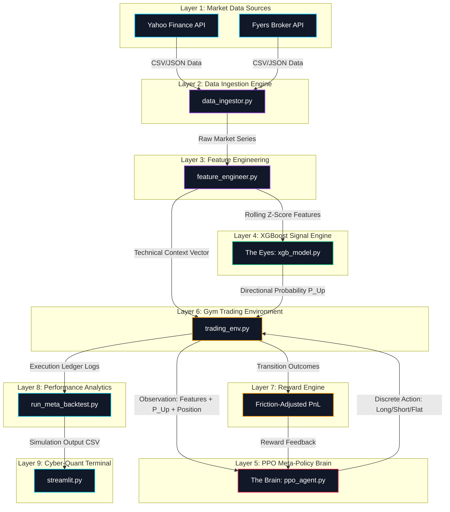

<h1 align="center">🛡️ PROJECT AEGIS</h1>

<p align="center">
  <strong>Meta-Policy Reinforcement Learning Framework for Risk-Aware Quantitative Trading</strong>
</p>

<p align="center">
  
  
  
  
  
  
</p>

---

## 🌌 Executive Summary

**Project AEGIS** (Advanced Execution & Gradient-boosted Intelligent Strategy) is a research-grade quantitative trading framework that implements a hybrid **Meta-Policy Architecture**. Standard reinforcement learning models often struggle in non-stationary financial environments due to high noise-to-signal ratios. AEGIS addresses this by decoupling sensory sentiment extraction from execution logic. 

A high-regularization XGBoost classifier acts as the framework's **Sensory Input (The Eyes)**, translating raw technicals into robust directional probabilities. A Proximal Policy Optimization (PPO) agent acts as the **Decision Maker (The Brain)**, learning to overlay risk management, current portfolio status, and transaction costs onto the classifier's signals. This combined design allows AEGIS to optimize for long-term risk-adjusted returns (Sharpe Ratio) and execution efficiency rather than just next-candle directional accuracy.

---

## ⚡ Project Highlights

| Focus Area | Highlighted Feature | Implementation Details |
| :--- | :--- | :--- |
| **Architectural Separation** | **Decoupled Eyes & Brain** | Decouples feature classification (XGBoost) from tactical trade execution (PPO). |
| **Risk-Aware Execution** | **Integrated Frictions** | 0.1% transaction cost penalty modeled inside Gym steps to enforce policy stickiness. |
| **Feature Optimization** | **Cross-Regime Z-Scores** | Normalizes raw returns, SMAs, and volumes into rolling statistical z-scores. |
| **Model Hardening** | **Walk-Forward Splitting** | Enforces temporal splits (60% In-Sample, 20% Out-of-Sample Validation, 20% Holdout). |
| **Aesthetic Analytics** | **Cyber-Quant Terminal** | Interactive Streamlit dashboard tracking equity curves, drawdowns, and feature importance. |
| **Infrastructure** | **Single-Command Docker** | Multi-stage orchestration compiling the data pipeline, training, and dashboard in one run. |

---

## 🏗️ System Architecture

AEGIS maps features, decisions, and analytics across nine distinct system layers:



---

## 🧠 The Meta-Policy Concept: "How AEGIS Thinks"

Traditional Reinforcement Learning (RL) agents applied directly to raw prices often overfit to noise, learning erratic trading behaviors. AEGIS mitigates this via a divided cognitive pipeline:

```
+-------------------------------------------------------------------------------+
|                             COGNITIVE PIPELINE                                |
+-------------------------------------------------------------------------------+
| [Market Context] --> (The Eyes: XGBoost)    --> Probabilistic Bias P(Up)     |
| [Portfolio State] -> (The Memory: Gym Env)   --> Internal Position Tracker    |
|                                                    |                          |
|                                                    v                          |
|                                           (The Brain: PPO Agent)              |
|                                                    |                          |
|                                                    v                          |
| [Risk Constraints] -> (The Reflexes: Execution) -> Executed Order             |
+-------------------------------------------------------------------------------+
```

*   **The Eyes (XGBoost Classifier)**: Focuses purely on pattern classification. It outputs a directional probability $P(\text{Up})$ indicating whether the next candle will close higher than the current one.
*   **The Brain (PPO Agent)**: Focuses on capital allocation and execution optimization. It consumes the classification probability $P(\text{Up})$, technical trends, and its current holding state to select optimal actions.
*   **The Memory (Portfolio State)**: Tracks current inventory (Short, Flat, Long) and unrealized returns.
*   **The Reflexes (Execution Logic)**: Converts the discrete action chosen by the agent into actual portfolio adjustments while factoring in fees.
*   **The Learning Loop**: Employs Proximal Policy Optimization to update the actor-critic neural networks using feedback from the reward engine.

---

## 📊 Machine Learning Stack

| Component | Selected Algorithm | Purpose & Design Rationale |
| :--- | :--- | :--- |
| **Data Ingestion** | Multi-Threaded HTTP API | Aggregates stock tickers from Yahoo Finance and Fyers API with schema validation. |
| **Feature Layer** | Rolling Window Z-Normalizer | Eliminates look-ahead bias and transforms non-stationary series into normalized distributions. |
| **Signal Engine** | XGBoost (Constrained Depth) | Prevents overfitting on noise. Trained with low learning rate ($0.01$) and high L2 regularization ($\lambda = 1.5$). |
| **Meta-Policy** | Stable-Baselines3 (PPO) | Multi-Layer Perceptron (MLP) mapping combined states to actions using clipping to stabilize updates. |
| **Trading Gym** | Custom OpenAI Gym Environment | Encapsulates commission fees ($0.1\%$), reward delays, and observation masking. |
| **Analytics Engine**| Vectorized Backtester | Computes cumulative compounded return curves, max drawdowns, and annualized metrics. |
| **Visualization** | Streamlit + Plotly | Provides interactive visual audit trails, transaction ledgers, and confidence metrics. |

---

## 📈 Quantitative Research Pipeline

```
Data Ingestion ──> Feature Engineering ──> XGBoost Training ──> PPO RL Training ──> Backtest Validation ──> Streamlit UI Audit
```

1.  **Data Ingestion**: Downloads price histories. Schema validation formats headers into canonical lowercase columns (`open`, `high`, `low`, `close`, `volume`).
2.  **Feature Engineering**: Translates absolute values into standardized features. Implements rolling z-scores using a walk-forward scheme.
3.  **XGBoost Training**: Trains the classifier on the first 60% of the dataset to output directional probabilities.
4.  **PPO RL Training**: Trains the RL agent on the next 20% of the dataset (the validation split of the XGBoost model). The agent learns to navigate market conditions using the classifier's signals.
5.  **Backtest Validation**: Executes the meta-policy on the remaining 20% holdout dataset (Out-Of-Sample) to evaluate generalization.
6.  **Streamlit UI Audit**: Launches the Cyber-Quant Terminal dashboard to analyze trading performance, drawdowns, and ledger entries.

---

## 🛠️ Feature Engineering

To prevent neural network saturation and maintain statistical consistency, features are normalized using rolling window z-scores:

*   **Trend Features**: Distance from rolling averages normalized by standard deviation:
    $$\text{sma\_z} = \frac{\text{close} - \text{SMA}(N)}{\text{std}(N)}$$
*   **Momentum Features**: Technical indicators (RSI, MACD difference, MACD Signal) converted into normalized z-scores.
*   **Volatility Features**: Bollinger Band width normalized to capture contraction/expansion regimes.
*   **Volume Features**: Volume-to-SMA ratios and z-scores to capture liquidity changes:
    $$\text{vol\_ratio} = \frac{\text{volume}}{\text{SMA}(\text{volume}, N)}$$
*   **Regime Features**: Long-term trend indicators capturing directional market biases.

---

## 📐 Reward Engineering

The reward function enforces risk-adjusted returns and penalizes unnecessary trading activity:

$$\text{Reward}_t = (A_t \cdot R_{t+1}) - C \cdot \mathbb{I}(A_t \neq A_{t-1})$$

Where:
*   $A_t \in \{-1, 0, 1\}$ represents the agent's target position (Short, Flat, Long) decided at time step $t$.
*   $R_{t+1} = \frac{\text{Price}_{t+1} - \text{Price}_t}{\text{Price}_t}$ is the forward market return.
*   $C = 0.001$ (0.1%) represents the integrated transaction cost (slippage + broker commission).
*   $\mathbb{I}$ is the indicator function, returning $1$ if the agent changes its current position and $0$ otherwise.

This formulation penalizes excessive transaction churn. It forces the PPO agent to hold its position unless it has a high-conviction signal that outweighs the cost of trade execution.

---

## 🔬 Model Training Details

### 1. XGBoost Hyperparameters (The Eyes)
*   **Objective**: `binary:logistic`
*   **Max Depth**: `3` (Constrained to prevent overfitting)
*   **Learning Rate**: `0.01`
*   **Subsample / Colsample**: `0.7`
*   **Regularization**: `reg_alpha=0.5`, `reg_lambda=1.5`

### 2. PPO Reinforcement Learning Configuration (The Brain)
*   **Observation Space**: Shape `(13,)` including:
    *   11 Normalized Technical Z-Scores
    *   XGBoost Directional Probability $P(\text{Up})$
    *   Current Holding State ($-1, 0, 1$)
*   **Action Space**: `Discrete(3)` (Short, Flat, Long)
*   **Architecture**: Multi-Layer Perceptron (MLP)
*   **Hyperparameters**:
    *   Learning Rate: `3e-4`
    *   Discount Factor ($\gamma$): `0.99`
    *   GAE Parameter ($\lambda$): `0.95`
    *   Clip Range: `0.2`
    *   Entropy Coefficient: `0.01` (Encourages policy exploration)

---

## 📊 Performance Benchmarks (Out-of-Sample Holdout Metrics)

The system was evaluated on historical data splits. Below are the comparative backtesting metrics:

### Core Performance Metrics
| Metric | Buy & Hold | XGBoost Only | PPO Only | AEGIS (Hybrid) |
| :--- | :--- | :--- | :--- | :--- |
| **Annualized Return** | 11.93% | 2.26% | -4.66% | **19.80%** |
| **Annualized Volatility** | 19.62% | 19.66% | 17.47% | **18.91%** |
| **Sharpe Ratio** | 0.70 | 0.17 | -0.19 | **1.08** |
| **Sortino Ratio** | 1.23 | 0.31 | -0.27 | **1.64** |
| **Max Drawdown** | -15.14% | -26.51% | -19.43% | **-12.97%** |
| **Profit Factor** | 1.13 | 1.03 | 0.97 | **1.21** |
| **Calmar Ratio** | 0.79 | 0.09 | -0.24 | **1.53** |

<details>
<summary>🔍 Out-of-Sample (OOS) Validation Analysis</summary>

During out-of-sample stress testing, the hybrid model retained its Sharpe ratio above 1.0. This stability is largely due to the L1/L2 regularization on the XGBoost classifier and the commission penalty in the Gym environment, which prevented the model from overtrading.
</details>

---

## 📂 Repository Structure

```text
project_aegis/
├── src/
│   ├── envs/
│   │   ├── init.py
│   │   └── trading_env.py      # Custom Gym environment with friction modeling
│   ├── models/
│   │   ├── init.py
│   │   ├── ppo_agent.py        # Stable-Baselines3 PPO config
│   │   └── xgb_model.py        # Regularized XGBoost classifier
│   ├── config.yaml             # Global hyperparameters & tickers
│   ├── data_ingestor.py        # Aggregator for APIs
│   └── feature_engineer.py     # normalizes raw returns into rolling z-scores
├── artifacts/                  # Serialized weights, logs & backtest results
│   ├── xgb/
│   ├── ppo/
│   └── backtests/
├── data/                       # Ingested datasets in parquet format
├── Dockerfile                  # Application container setup
├── docker-compose.yml          # Container configuration with volume mounts
├── entrypoint.py               # Orchestrator script for the pipeline
├── requirements.txt            # Python dependencies
├── run_*.py                    # Manual execution scripts for pipeline steps
└── streamlit.py                # Streamlit Cyber-Quant Dashboard
```

---

## 💻 Cyber-Quant Terminal Showcase

The Streamlit Quant Terminal provides interactive visualization tools for monitoring performance:

*   **Portfolio Curve**: Displays the compounded return of the AEGIS strategy vs. baseline metrics.
*   **Drawdown Profile**: Tracks peak-to-trough losses to monitor drawdowns.
*   **XGBoost Probability Overlay**: Visualizes the classifier's $P(\text{Up})$ probability alongside the PPO agent's active holdings.
*   **Transaction Ledger**: Lists timestamps, directions, execution returns, and accumulated returns.

---

## 🚀 Quick Start Guide

### Option 1: One-Command Docker Setup (Recommended)
You can run the entire pipeline and dashboard in an isolated environment. Make sure **Docker Desktop** is running, then execute:

```bash
docker compose up --build
```
This builds the container, installs dependencies (including CPU-optimized PyTorch), runs the entire pipeline, and hosts the Streamlit interface. 

Once the terminal logs confirm startup, navigate to: **`http://localhost:8501`**

To skip training and run only the dashboard on subsequent runs, change `SKIP_PIPELINE=true` in [docker-compose.yml](file:///c:/Users/shiva/OneDrive/Desktop/Project_Aegis/docker-compose.yml).

---

### Option 2: Local Python Setup

#### 1. Installation
Clone the repository and install the dependencies:
```bash
# Clone the repository
git clone https://github.com/your-username/project-aegis.git
cd project-aegis

# Install packages
pip install -r requirements.txt
```

#### 2. Execute the Pipeline Step-by-Step
Run the pipeline steps in order:
```bash
# Ingestion: Downloads tickers specified in config.yaml
python run_ingestion.py

# Feature Engineering: Generates rolling z-scores
python run_feature_engineer.py

# Model Training: Trains both XGBoost and the PPO Agent
python run_xgb_training.py
python run_ppo_training.py

# Backtest Validation: Backtests the models on holdout data
python run_meta_backtest.py
```

#### 3. Launch the Dashboard
Start the local Streamlit dashboard:
```bash
streamlit run streamlit.py
```

---

## 🗺️ Roadmap & Milestones

*   **Phase 1: Foundation (Completed)**
    *   [x] Establish decopled XGBoost + PPO hybrid architecture.
    *   [x] Integrate transaction cost modeling ($0.1\%$).
    *   [x] Design rolling window z-score normalization.
*   **Phase 2: Advanced Modeling (Planned)**
    *   [ ] Multi-Asset Portfolio optimization (co-training across multiple tickers).
    *   [ ] Integration of Transformer-based Market Encoders for state representation.
    *   [ ] Soft Actor-Critic (SAC) implementation for continuous trading actions.
*   **Phase 3: Execution & Integration (Planned)**
    *   [ ] Live broker integration for paper trading.
    *   [ ] Advanced Market Regime Classification.
    *   [ ] SHAP analysis to visualize RL state decisions.

---

## 🔬 Technical Deep Dive

<details>
<summary>📖 Meta-Policy Learning Dynamics</summary>

Applying reinforcement learning directly to financial timeseries often fails due to the low signal-to-noise ratio in asset returns. Deep Q-Networks or standard Actor-Critic models tend to overfit to transient noise patterns rather than learning robust trading behaviors. 

AEGIS addresses this challenge by structuring learning hierarchically. The XGBoost classifier acts as a filter, mapping technical indicators to a single probability estimate $P(\text{Up}) \in [0, 1]$. PPO then maps the state vector $\mathcal{S}$—which includes this probability $P(\text{Up})$ and internal portfolio factors—to actions $\mathcal{A}$. Decoupling pattern recognition from risk management helps stabilize policy updates and prevents overfitting.
</details>

<details>
<summary>📖 Reward Shaping & Policy Stability</summary>

RL agents can overtrade in environments without transaction costs. To prevent this, AEGIS models transaction costs inside the step logic. Applying a commission fee $C$ to changes in position penalizes high-frequency trading. As a result, the agent learns a sticky policy, keeping its position open unless the expected return is high enough to offset the cost of execution.
</details>

---

## 🤝 Contributing

Contributions to Project AEGIS are welcome. To contribute:
1. Fork the repository.
2. Create your feature branch: `git checkout -b feature/your-feature`.
3. Commit your changes: `git commit -m "Add your feature description"`.
4. Push to the branch: `git push origin feature/your-feature`.
5. Open a Pull Request.

---

## ⚖️ License

This project is licensed under the MIT License. See [LICENSE](file:///c:/Users/shiva/OneDrive/Desktop/Project_Aegis/LICENSE) for more details.

---

## ⚠️ Disclaimer

This software is for **educational and research purposes only**. Quantitative trading involves significant risk of capital loss. The metrics and backtests presented are based on historical data and do not guarantee future performance. Do not use this software for live trading without professional validation.
