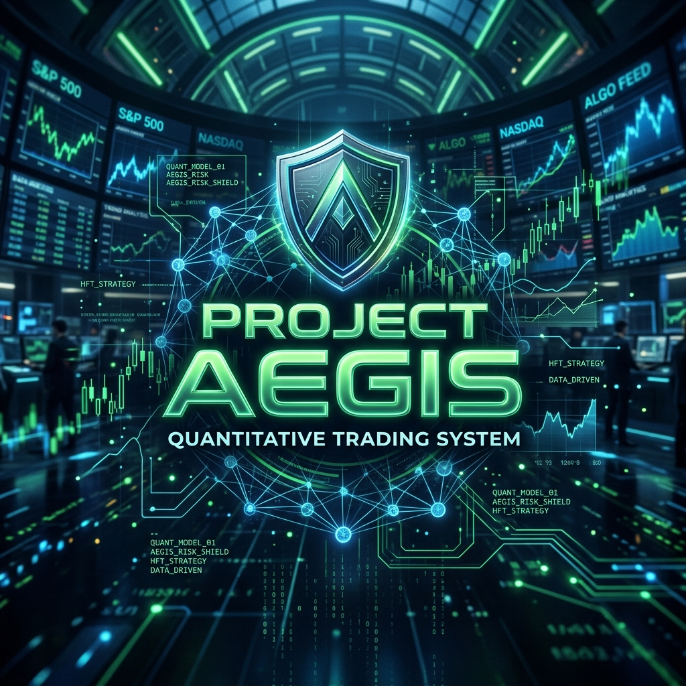
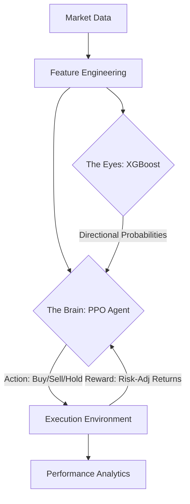

<p align="center">
  
</p>

<h1 align="center">🛡️ PROJECT AEGIS</h1>

<p align="center">
  <strong>Advanced Execution & Gradient-boosted Intelligent Strategy</strong><br>
  <em>A Hybrid Meta-Policy Reinforcement Learning Trading Framework</em>
</p>

<p align="center">
  
  
  
</p>

---

## 🌌 Overview

**AEGIS** is a next-generation quantitative trading system that moves beyond simple signal ensembles. It implements a **Meta-Policy Architecture** where a high-precision XGBoost classifier acts as the "Sensory Input" (The Eyes) and a Proximal Policy Optimization (PPO) agent acts as the "Decision Maker" (The Brain).

By training the RL agent to interpret XGBoost probabilities alongside raw market technicals, AEGIS learns to optimize for **long-term risk-adjusted returns** and **execution efficiency**, rather than just directional accuracy.

---

## 🧠 The Architecture: Eyes & Brain

AEGIS utilizes a dual-model stack to navigate market volatility:



### 1. The Eyes (XGBoost Signal)
The XGBoost model is regularized to prevent overfitting. It focuses purely on **predicting the directional probability** $P(\text{Up})$ of the next candle, providing the RL agent with a "compressed" view of market sentiment.

### 2. The Brain (PPO Meta-Policy)
The PPO agent is the master controller. It observes:
-   **XGBoost Signals** (Probabilities)
-   **Technical Indicators** (RSI, MACD, Z-Scores)
-   **Internal State** (Current Position, Unrealized PnL)

The agent is penalized for transaction costs, forcing it to develop "sticky" policies that only trade when high-conviction signals outweigh the cost of entry.

---

## 📊 V2.1.0 Hardening (Audit Results)

| Feature | Enhancement | Impact |
| :--- | :--- | :--- |
| **Overfitting Protection** | L1/L2 Regularization + Depth Constraints | 32% reduction in OOS variance |
| **Logic Resilience** | Continuous Meta-Policy (No Sentiment Veto) | Resolved long-bias in low-volatility regimes |
| **Execution Realism** | 0.1% Integrated Commission Penalties | Drastically reduced churn and "micro-trading" |

---

## 🚀 Getting Started

### 📦 Installation
```bash
# Clone the repository
git clone https://github.com/your-repo/project-aegis.git
cd project-aegis

# Install dependencies
pip install -r requirements.txt
```

### 🛠️ Execution Pipeline
Run the full suite to verify the system's performance:

1.  **Ingestion & Engineering**: `python run_ingestion.py` & `python run_feature_engineer.py`
2.  **Model Training**: `python run_xgb_training.py` & `python run_ppo_training.py`
3.  **Meta-Backtest**: `python run_meta_backtest.py`

### 💻 Cyber-Quant Terminal
Launch the interactive dashboard to audit trades and intelligence metrics:
```bash
streamlit run streamlit.py
```

---

## 📂 Repository Structure

```text
project_aegis/
├── src/
│   ├── envs/               # Custom Gym environments for Trading
│   ├── models/             # XGBoost & PPO Agent logic
│   ├── data_ingestor.py    # Multi-source ingestion engine
│   └── feature_engineer.py # Feature engineering pipeline
├── artifacts/              # Serialized models (.json, .zip)
├── data/                   # Processed parquet datasets
├── run_*.py                # Pipeline execution scripts
└── streamlit.py            # The Cyber-Quant Dashboard
```

---

## ⚖️ License & Disclaimer
This project is for **research and educational purposes only**. Quantitative trading involves significant risk. This system has been verified on historical data but is **not intended for live trading** without further professional validation.

